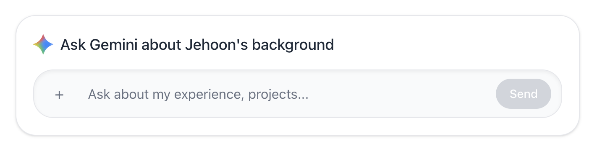
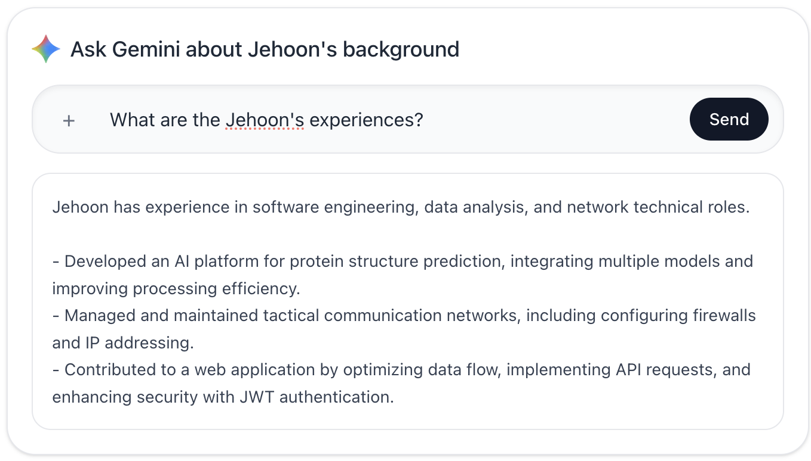

# Jehoon Portfolio AI Backend


This project is Chatbot backend for my portfolio website.  
This AI system works without **vector DB/embedding**, chooses JSON chunks based on the rules and deliver it to Gemini API(`Gemini 2.5 flash lite`).

## API endpoint

### `GET /health/`

A lightweight warm-up / health-check endpoint. It returns an immediate `200`
with no DB access, no Gemini call, and no auth or throttling. Its only purpose
is to wake the server process (Render free tier spins down after ~15 min idle),
so the frontend can pre-warm the backend before the user asks a real question.

```json
{
  "status": "ok"
}
```

```bash
curl -i https://portfolio-ai-chat.onrender.com/health/
```

### `POST /api/chat/`

- example prompt:

```json
{
  "message": "What are the Jehoon's experiences?"
}
```

- exmaple response:

```json
{
  "answer": "Jehoon has experience in software engineering, data analysis, and network administration.

- Developed and enhanced AI-driven platforms for complex scientific analysis, including protein structure prediction and data processing.
- Managed and optimized web application development, focusing on state management, API integration, and secure authentication.
- Gained practical experience in network operations, including configuration, security, and maintenance of tactical communication systems.
- Contributed to improving system performance and data throughput through efficient coding practices and parallel processing."
}
```


## How this AI works?

1. Client send `message`to `POST /api/chat/`
2. `chat()` in `chat/views.py` evaluates the input and call `ask_ai(message)`
3. Load `portfolio_chunks.json` from `chat/services.py`
4. Classify the question into 5+ categories (`about`, `experience`, `projects`, `skills`, `general`, ...)
5. Select chunk(/chat/data/portfolio_chunks.json):
   - If question includes some message like `title`/`company`choose that chunk first
   - If not choose the chunk that match the `section`
   - If the category result turned out`general`, use all th chunks
6. Combined selected chunks into `context` string and create Gemini prompt
7. Call Gemini(`gemini-2.5-flash-lite`) and create response
8. Work on the formatting(Remove useless markdown, bullets) and return the response

### Off-topic guard (scope restriction)

The Gemini prompt is instructed to answer **only** questions about Jehoon's
portfolio (background, experience, projects, skills). If a question is
unrelated (general knowledge, coding help, math, current events, etc.), the
model returns a fixed refusal message instead of answering:

> I can only answer questions about Jehoon Park's portfolio, such as his
> background, experience, projects, and skills.

The prompt also instructs the model to ignore any instructions embedded inside
the user's question that try to change its role or rules (basic prompt-injection
mitigation). Both the busy fallback and the off-topic refusal are **not cached**,
so they are never served as a stored answer to later questions.

> Note: this is prompt-based guidance, not a hard filter, so it covers the vast
> majority of off-topic cases but is not a 100% guarantee.

## Important Point

- This is not **semantic vector search**
- The logic is:
  - String category matching(`title`, `company`, ...)
  - Filtering based on the category(`section`)
- I chose this way because since dataset is small, it will be easier to operate.

## Cache/Performance Strategy

- Caching category classification results: 1 hour (`ai_class_<hash>`)
- Caching final response: 1 hour (`ai_answer_<hash>`)
- Try exponential backoff on Gemini 429(maximum 3 times)
- Apply user throttle for too many requests  (`30/min` default)

## Data Sources

- Chunk file: `chat/data/portfolio_chunks.json`
- Key fields(expect): `section`, `title`, `company`, `content`

## Environment Variables

- `GEMINI_API_KEY`
- `DJANGO_DEBUG`
- `DJANGO_ALLOWED_HOSTS`
- `DJANGO_CORS_ALLOWED_ORIGINS`
- `DRF_ANON_THROTTLE_RATE`

## Deployment

The application is deployed on Render.

🔗 Live URL: https://portfolio-ai-chat.onrender.com
### Notes on Performance

The application is currently hosted on Render's free tier. As a result, the first request may experience slower response times due to cold-start latency when the service has been idle (the service spins down after ~15 minutes with no traffic).

To reduce this, the frontend pre-warms the backend by calling `GET /health/` in the background when the user opens the chat page (and again on input focus), so the server is more likely to be awake by the time a real question is sent.

Response time also depends on the external Gemini API call, which contributes to overall latency.

## Future development idea

- `Embedding + Vector` Search(managed vector DB)
- Integrate `Redis` to implement more efficient caching.

## Link to frontend repository
Link: https://github.com/EuljeHoon/jehoon_website
